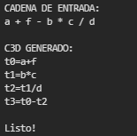
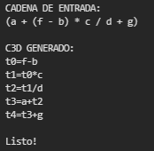
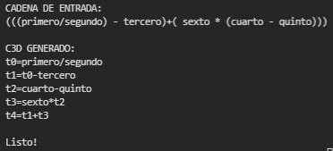

# GeneradorC3D_Sencillo
Generador de código intermedio de funciones aritméticas utilizando ply

## GENERALIDADES

| Nombre       | Carpeta/Archivo | Descripción                                                                                                   |
|--------------|:---------------:|---------------------------------------------------------------------------------------------------------------|
| ply          |        C        | Contiene los generadores de analizadores léxicos y sintácticos                                                |
| refExample   |        C        | Contiene un ejemplo utilizado como referencia (ejecución de expresiones aritméticas)                          |
| test_inputs  |        C        | Contiene los archivos de entrada probados                                                                     |
| gramatica    |        A        | Definición del analizador Léxico y sintáctico, generando C3D haciendo uso de una variable global              |
| gramaticaObj |        A        | Def. del analizador Léxico y sintáctico, generando C3D utilizando POO para los atributos de los no terminales |

## GRAMÁTICA :construction: 

~~~
S   ->  E
E   ->  E + T
E   ->  E - T
E   ->  T
T   ->  T * F
T   ->  T / F
T   ->  F
F   ->  ( E )
F   ->  ID
~~~

## EJEMPLOS EJECUCIÓN

### TEST 1

### TEST 1

### TEST 1
 

#

*By:* Jessica Botón - 201800535